<h1 align="center">web-monitor</h1>

   
  <i>web-monitor is a monitor platform for both mobile and desktop web applications
      using Java/Angular/React/vue and other languages.</i>
   

## Documentation

Get started with web-monitor, explore on our documentation website.

- [Getting Started][quickstart]
- [API][api]

## Quickstart

[Get started in 5 minutes][quickstart].

## Project Structure

web-monitor 
　　├── web-monitor-sdk 
　　│　　 ├── web-monitor-sdk-core 
　　│　　 └── web-monitor-sdk-client 
　　├── web-monitor-server 
　　│　　 ├── sql 
　　│　　 │　 　└── pdm 
　　│　　 └── web-monitor-server-java 
　　└── web-monitor-ui 
　　│　　 ├── axure 
　　│　　 │　 　├── web 
　　│　　 │　 　└── app 
　　│　　 ├── web-monitor-ui-angular10 
　　│　　 └── web-monitor-ui-react16 

## Screenshots

- web

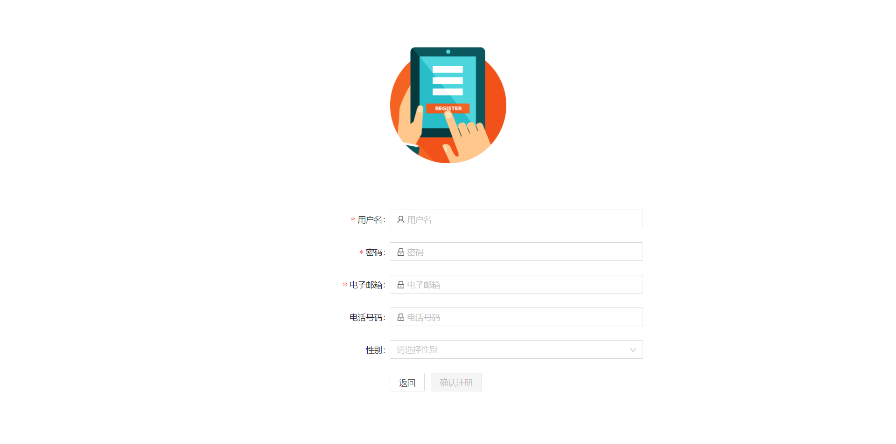

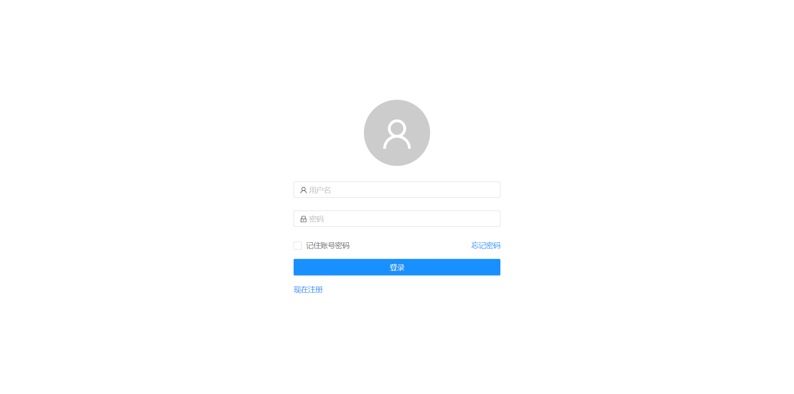

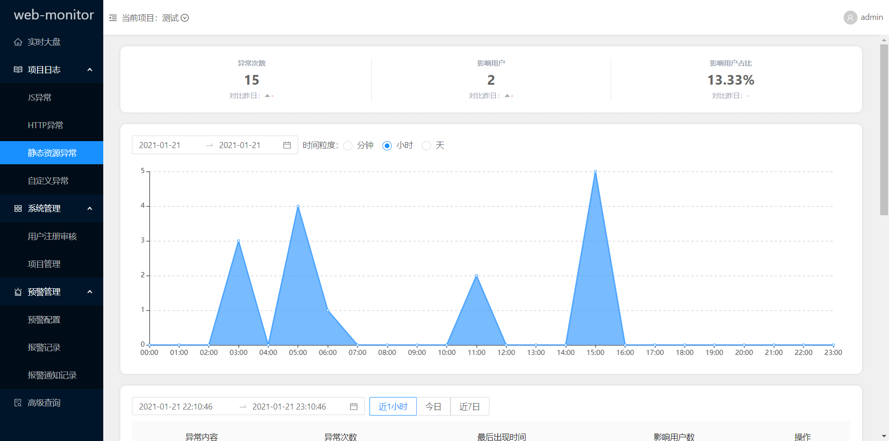

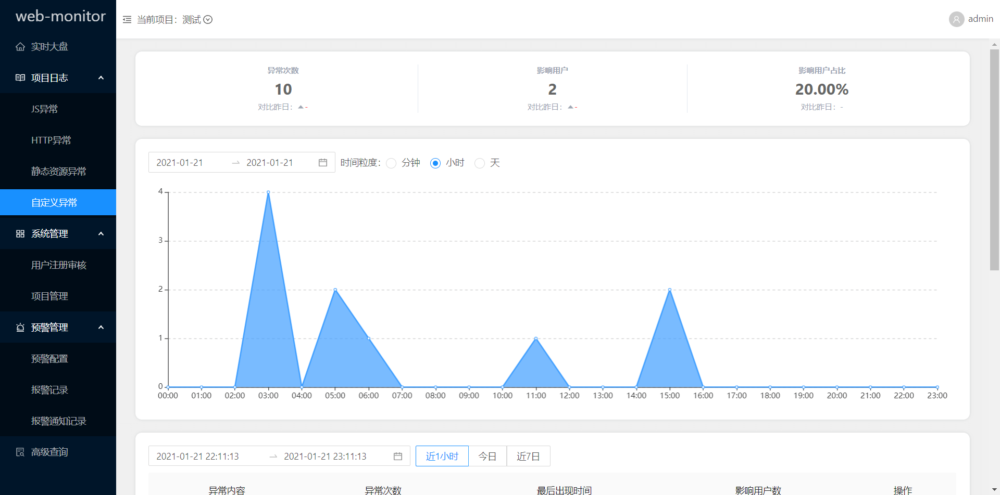

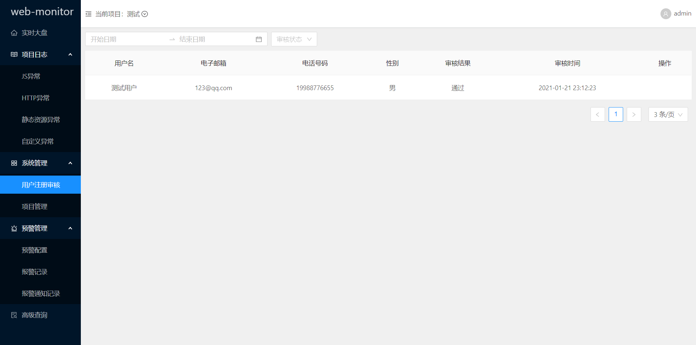

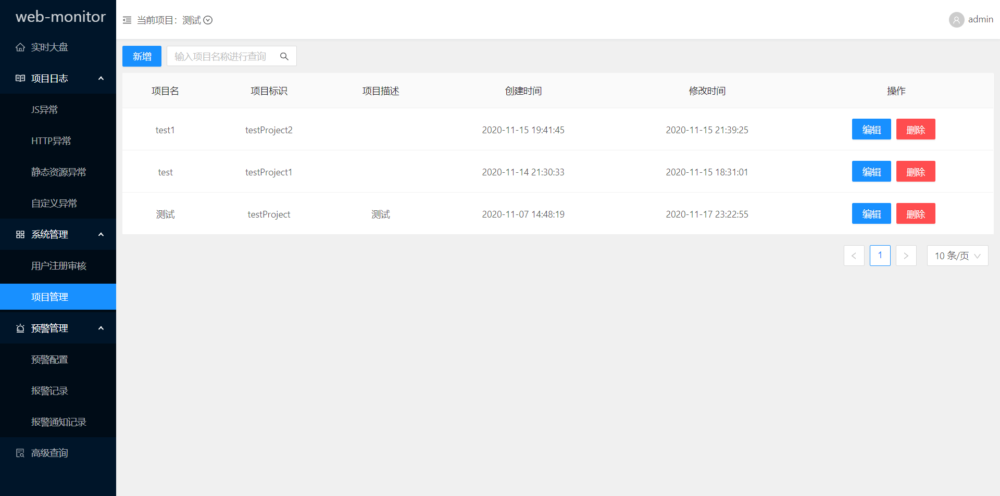

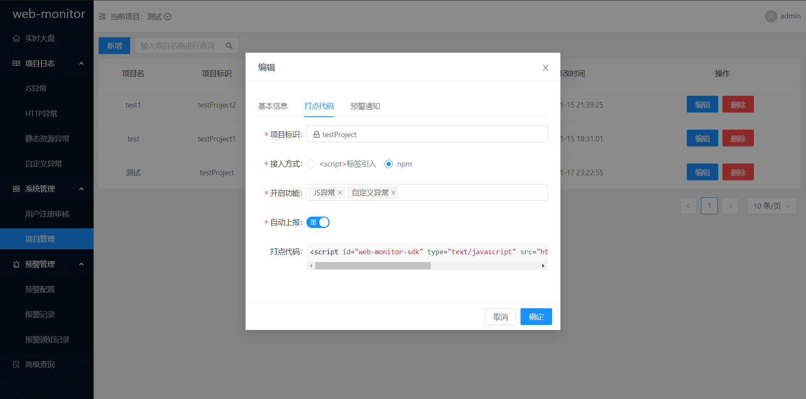

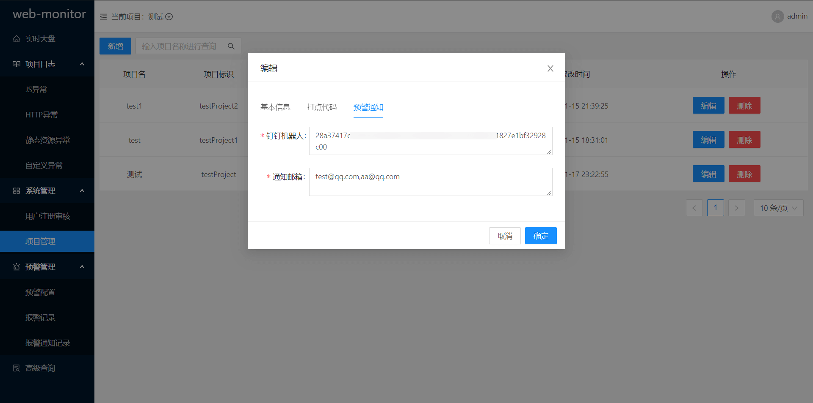

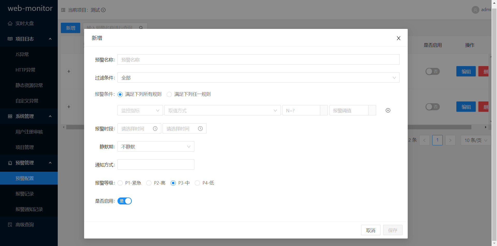

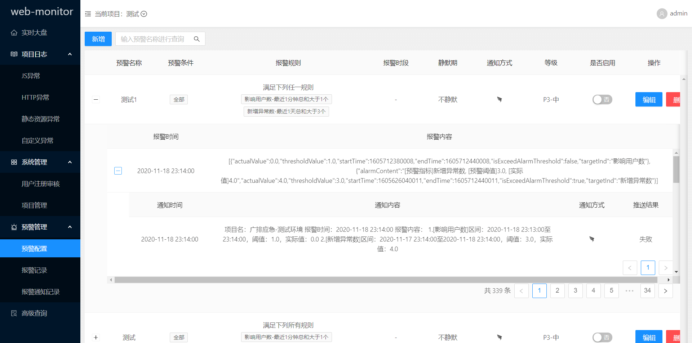

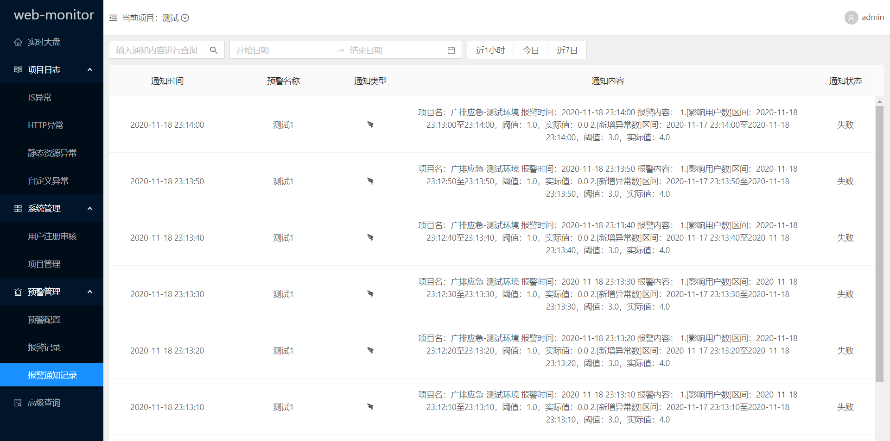

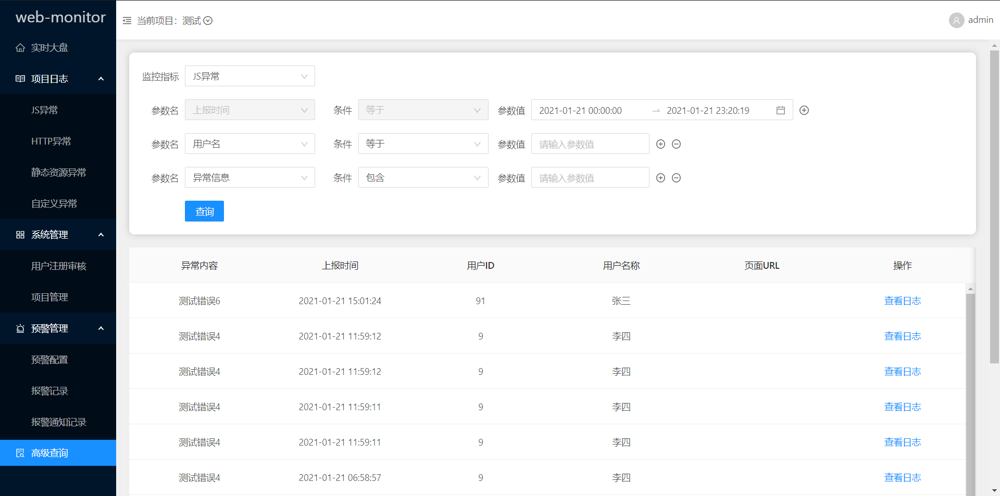

[quickstart]: https://
[changelog]: CHANGELOG.md
[documentation]: https://
[api]: https://
