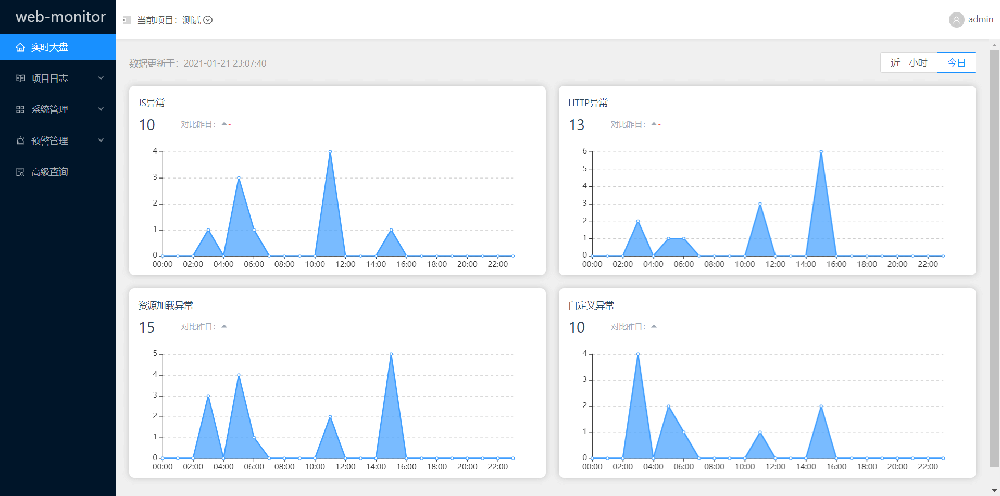
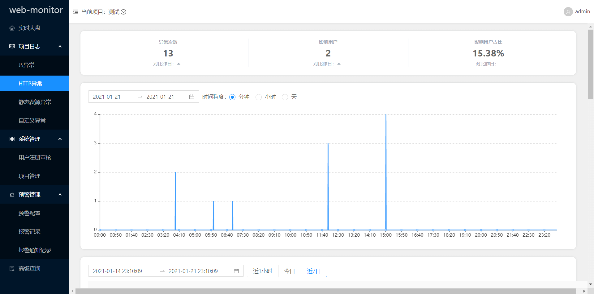
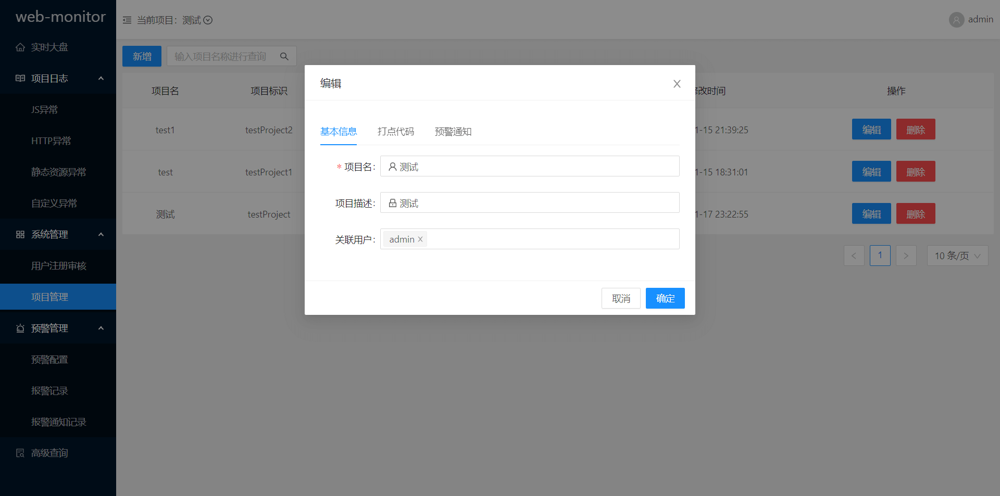
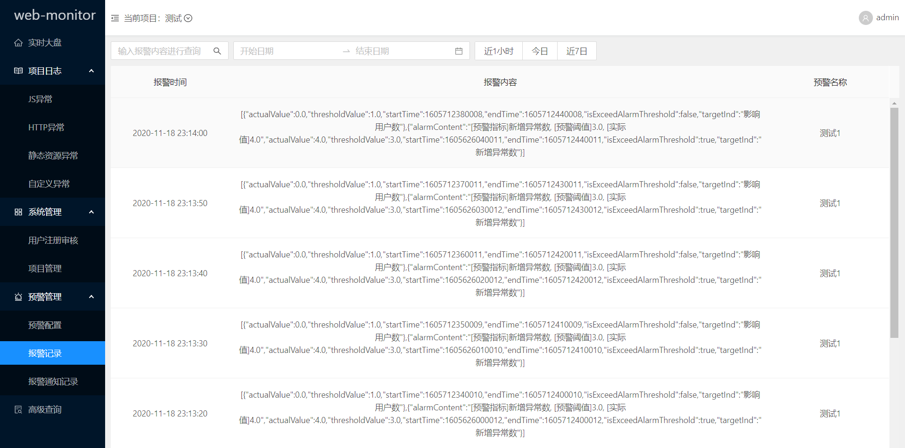
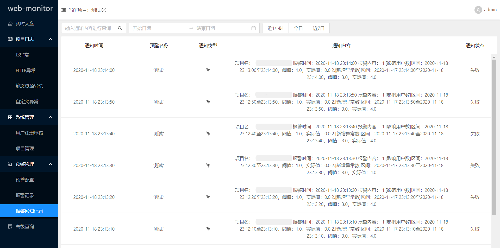
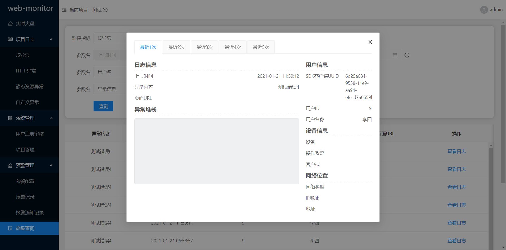

<h1 align="center">web-monitor-ui</h1>

   
  <i>web-monitor is a monitor platform for both mobile and desktop web applications
      using Java/Angular/React/Vue and other languages.</i>
   

## Screenshots

- 注册页

- 登录页

- 实时大盘

- 项目日志-JS异常

- 项目日志-HTTP异常

- 项目日志-静态资源异常

- 项目日志-自定义异常

- 系统管理-用户注册审核

- 系统管理-项目管理

- 预警管理-预警配置

- 预警管理-报警记录

- 预警管理-报警通知记录

- 高级查询

